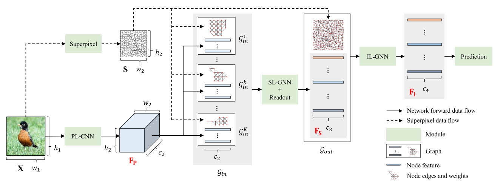
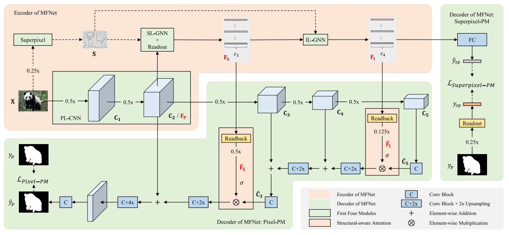
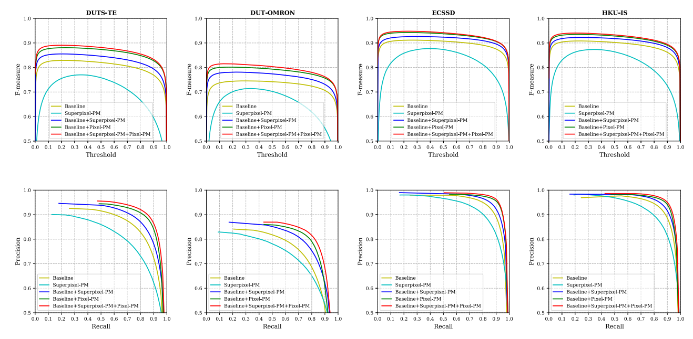
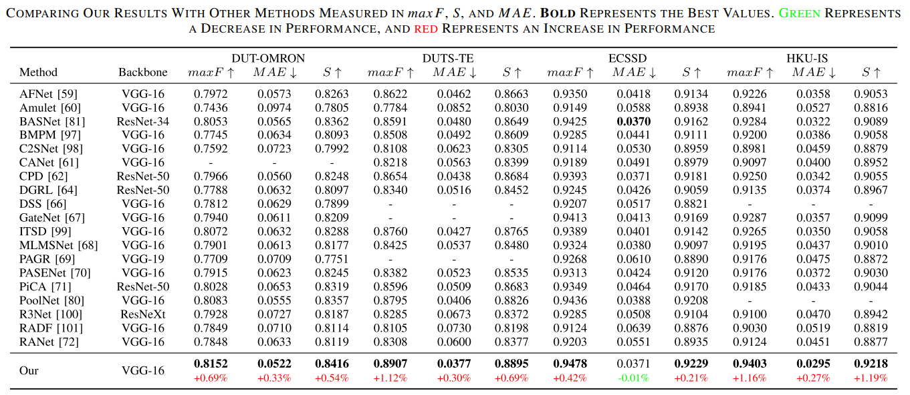
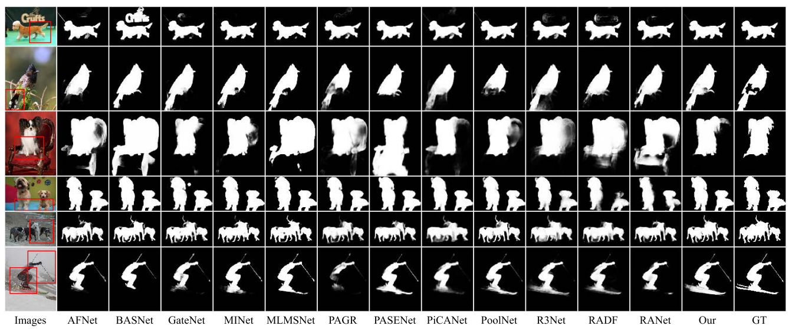

### MFNet

The code of [MFNet: A Novel GNN-Based Multi-Level Feature Network With Superpixel Priors](https://ieeexplore.ieee.org/document/9953965)


### Pipeline





### Datasets

> Directory structure reference `SODData.py`

- [DUTS](http://saliencydetection.net/duts/)
- [ECSSD](http://www.cse.cuhk.edu.hk/leojia/projects/hsaliency/dataset.html)
- [PASCAL-S](http://cbi.gatech.edu/salobj/#download)
- [DUT-OMRON](http://saliencydetection.net/dut-omron/)
- [HKU-IS](https://i.cs.hku.hk/~gbli/deep_saliency.html)
- [SOD](http://elderlab.yorku.ca/SOD/)
- [THUR](http://mmcheng.net/code-data/)
- [MSRA10K](https://mmcheng.net/msra10k/)
- [SED](http://www.wisdom.weizmann.ac.il/~vision/Seg_Evaluation_DB/dl.html)


### Installing

> torch==1.4.0+cu100

```
pip install torch-scatter==latest+cu100 -f https://pytorch-geometric.com/whl/torch-1.4.0.html
pip install torch-sparse==latest+cu100 -f https://pytorch-geometric.com/whl/torch-1.4.0.html
pip install torch-cluster==latest+cu100 -f https://pytorch-geometric.com/whl/torch-1.4.0.html
pip install torch-spline-conv==latest+cu100 -f https://pytorch-geometric.com/whl/torch-1.4.0.html
pip install torch-geometric=1.4.3
```


### Training

1. [Download VGG pretrained model: vgg16-397923af.pth](https://download.pytorch.org/models/vgg16-397923af.pth)

2. Set dataset path: `_data_root_path = "/your/data/path/SOD/DUTS"`

3. Just Run.


### Eval

1. Set Param

```
model_name = "MFNet_SOD"
from MFNet_SOD import MyGCNNet, MyDataset
model_file = "./ckpt/MFNet_SOD/0/epoch_xx.pkl"
_data_root_path = "/your/data/path/SOD"  # Change to Your Data Path
result_path = "./result/MFNet_SOD/0/epoch_xx"
```

2. Just Run.

3. For Final Eval Result, Please Use: [https://github.com/ArcherFMY/sal_eval_toolbox](https://github.com/ArcherFMY/sal_eval_toolbox)


### Result







### Reference

```
@ARTICLE{9953965,
  author={Li, Shuo and Liu, Fang and Jiao, Licheng and Chen, Puhua and Liu, Xu and Li, Lingling},
  journal={IEEE Transactions on Image Processing}, 
  title={MFNet: A Novel GNN-Based Multi-Level Feature Network With Superpixel Priors}, 
  year={2022},
  volume={31},
  number={},
  pages={7306-7321},
  doi={10.1109/TIP.2022.3220057}
}
```
